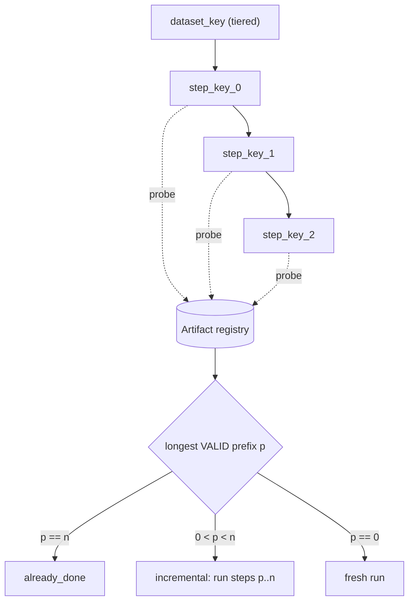
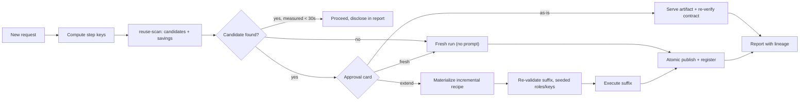

# Execution reuse architecture

How the audio agent avoids redoing work it has already done — without ever silently serving a
stale or wrong result.

The short version: stop asking *"was this whole recipe run before?"* and start asking
**"has this step, with these semantics and the same resolved dataset identity at
its recorded trust tier, already produced an artifact?"**

---

## 1. Why the old design could not reuse

The first reuse mechanism (`continuation.plan_continuation`) diffed a new recipe against one
parent `RunRecord`. It was correct but almost never fired. Five concrete reasons:

**Identity conflated three different things.** `Recipe._canonical()` hashes
`stages + inputs + preset + acceptance_criteria`. Execution knobs (`resources`, `batch_size`,
`num_workers`, `runtime_env`) live inside each stage's `params` and are only popped at build
time, so they were hashed too — as were output *locations*. Changing a GPU reservation, a batch
size, an output path, or **tightening the success bar** changed `config_hash` without changing a
single output byte. Every one of those is a reuse false negative.

**The dataset key was a shape hash.** `DataProfile.fingerprint()` covered
`source, kind, num_files, sample_rates, channels, mean_duration_sec, has_transcripts,
manifest_keys`, sampled from at most 256 files. That is simultaneously **unsafe** (a file edited
in place is invisible) and **too coarse** (adding one file invalidates everything). It is also
path-sensitive: the same corpus copied elsewhere looks like new data.

**Reuse was all-or-nothing and could not execute.** Only an exact `{ref, params}` *prefix append*
was supported; any middle edit or reorder meant `full_rerun`. The reuse anchor was always
`parent.output_paths`. `run()` never called the planner — the CLI just printed the plan, so a
human had to hand-rewrite the recipe.

**Intermediates existed on disk but were invisible.** Output discovery only looked at params
literally named `output_path` / `path` / `output_manifest` / `output_dir`. Resampled dirs, split
chunks, per-speaker audio and RTTM dirs were side effects nobody recorded. Worse,
`SplitLongAudioStage` writes chunks *beside the input* (`{stem}.{k}_of_{N}.wav`), mutating the
source folder and invalidating that dataset's own fingerprint.

**No cost data and no index.** `RunRecord` had no timings, no metrics, no versions; `goal` and
`notes` were never populated; `smoke()` recorded nothing. "Estimated time saved" was not
computable. Lookup was an `os.listdir` scan with no query by hash, dataset, stage, or date.

---

## 2. Step keys over artifacts

Identity is a Merkle chain over the pipeline:

```
dataset_key   = tiered_fingerprint(resolved_recipe_source)
step_key(0)   = H(dataset_key,   ref, semantic_params, code_version, model_version)
step_key(i)   = H(step_key(i-1), ref, semantic_params, code_version, model_version)
```

One mechanism gives whole-pipeline, prefix, and single-stage reuse, and invalidation falls out
of the chain instead of needing hand-written rules.



> **What limits `p` in practice.** Only a stage with an output-location parameter publishes an
> artifact (see [§5](#5-reuse-decision-logic)), so `p` can only land on a stage that wrote
> a file. In the common shape — several in-memory transforms feeding one terminal writer — the
> only artifact is the writer's, and inserting a stage before it changes the writer's key. So the
> realistic outcomes are `already_done` and `fresh`; `incremental` needs an intermediate stage
> that persists. This is a property of resuming from disk, not a gap in the lookup: there is
> genuinely nothing to resume from. Reuse still discloses it — a prefix whose step keys match an
> earlier completed run is reported as `prior_unsaved` with an offer to persist it next time, so
> recomputation is never silently presented as new work.

### Three hashes, three jobs

| Hash | Covers | Used for |
| --- | --- | --- |
| `semantic_hash` | stages + inputs + preset, with execution knobs and output locations stripped | reuse identity — "would this produce the same bytes?" |
| `contract_hash` | `acceptance_criteria` only | re-verification — a stricter bar re-judges data, it does not recompute it |
| `config_hash` | everything (unchanged) | the confirm gate — "what was approved is what runs" |

`config_hash` is deliberately left alone. It is the plan-execution integrity anchor and must keep
covering every byte a user approved, including the batch size they saw. Reuse simply stops using
it as the identity test.

Excluded from `semantic_hash` (in `recipe.EXECUTION_KNOB_PARAMS` and
`recipe.OUTPUT_LOCATION_PARAMS`):

- execution knobs — `resources`, `batch_size`, `num_workers`, `runtime_env`
- output locations — `output_path`, `output_manifest`, `output_dir`, `resampled_audio_dir`,
  `separated_audio_dir`, `rttm_out_dir`, `output_audio_tar_path`, `raw_data_dir`, `path`

The same `OUTPUT_LOCATION_PARAMS` set is what output discovery now scans, so resampled dirs,
per-speaker dirs and RTTM dirs stop being invisible side effects.

---

### Source binding before identity

The recipe's first supported source stage is execution truth. A closed adapter
table maps the five current standalone source stages to their exact configured
paths and path-resolution rules. `Recipe.inputs` and `--data` are assertions
only; they never mutate a stage. Missing, mismatched, unsupported, or unsafe
ambiguous bindings block execution before profiling or reuse lookup.

Some authored sources can execute without a reusable key: a multi-manifest
`ManifestReader` with singular `--data` omitted, a remote/directory/glob selector
that cannot be represented by one local profile, or a generated dataset before
its first materialization. Those runs do not publish into an empty identity
namespace. A successfully generated source is resolved and profiled again after
materialization, so subsequent artifact records bind to bytes that now exist.

---

## 3. Tiered dataset key

`DataProfile` now carries a tier alongside the shape hash:

| Tier | Basis | Trust | When used |
| --- | --- | --- | --- |
| `stat` | manifest/definition bytes plus sorted `(relpath, size, mtime_ns)` for referenced local files | high — catches ordinary metadata-visible edits | whenever all required local metadata is available |
| `shape` | incomplete source `identity_digest`, or the existing `fingerprint()` shape hash when no identity is available | low — metadata gaps can hide a mutation | fallback (remote/relative/unreadable sources) |

`DataProfile.dataset_key()` returns `"<tier>:<hash>"` and `fingerprint_tier` records which tier
produced it. Reuse against a `shape`-tier key is marked **low trust** on the approval card and
defaults to a fresh run.

Generic folder profiling excludes corroborated split-stage intermediates by
default. A source-stage adapter disables that heuristic whenever the source stage
itself would emit those files; executable input bytes may never be omitted from
identity merely to avoid invalidation.

The `stat` tier is metadata-backed rather than a full audio-content hash. A
mutation that deliberately restores both size and mtime still requires the
future content tier; this is why the reported tier remains part of every reuse
decision.

`fingerprint()` itself is unchanged and still stamps the layered-save `data_derived` annotations,
so nothing that depended on it shifts. The additive `identity_digest` only improves the low-trust
execution-reuse key when the profiler saw the source definition but could not build a complete
stat identity.

---

## 4. Metadata schema

### `Artifact` — one per completed step

```
identity  step_key, input_key, stage_ref, stage_index, semantic_params, contract_hash
location  uri, kind (manifest | audio_dir | rttm_dir | text_dir | unknown), complete_marker
evidence  rows_in, rows_out, bytes, content_digest, produced_roles, produced_keys, metrics
cost      started_at, ended_at, duration_sec, cumulative_sec, gpu_seconds, device
trust     dataset_key, fingerprint_tier, code_version, model_version, deterministic, status
```

`deterministic` is declared, never assumed: a GPU stage whose output can differ run to run must
say so, and non-deterministic artifacts are never reused without approval.

`cumulative_sec` — time from the *source* to this step, not just this step's own `duration_sec` —
is what reuse actually saves, and it is what the 30-second auto-take threshold is measured
against. Most pipelines persist only at their final writer, so charging reuse the writer's
milliseconds would auto-serve an hour-old ASR result without ever asking. For the last step it is
the run's wall clock (setup, scheduling and teardown are paid again on a rerun); earlier steps get
the sum of measured stage times up to that point.

### `RunRecord` additions

`steps` (the step-key chain), `semantic_hash`, `dataset_key`, `fingerprint_tier`, `elapsed_sec`,
`per_stage_metrics`, `acceptance_result` (the verification *outcome*, not just the criteria),
`env_summary`, `curator_version`, `knowledge_version` — and `goal` is finally populated.

### Storage

JSON records under `.audio_agent_runs/` stay the human-readable **source of truth**. Artifacts
live in `.audio_agent_runs/artifacts/{step_key}.json`. On top sits a **rebuildable** SQLite index
at `.audio_agent_runs/index.db` for O(1) `step_key` probes and queries by dataset / stage / date.
If the index is lost or corrupt, `reindex` rebuilds it from the JSON; nothing is only in the DB.

### Atomic publish

An artifact is only reusable once a `_COMPLETE` marker exists next to its `uri`
(`<uri>/_COMPLETE` for a directory, `<uri>._COMPLETE` for a file) containing the
`step_key`, row count, byte count, full serialized-output digest, and timestamp.
Lookup recomputes that digest, so editing a manifest or a file inside an audio
directory after publication invalidates both as-is service and continuation,
even when row count and byte size are unchanged. Legacy markers without a digest
fail closed and must be republished.

The marker also closes a crash-completeness bug: `ManifestWriterStage` appends,
so a crashed run left a partial-but-valid-looking JSONL, and re-running into the
same path silently duplicated rows—exactly how `per_speaker_audio/` ended up with
two copies of every file.

---

## 5. Reuse decision logic

An artifact is **valid** only if *all* of:

- the `_COMPLETE` marker is present and its `step_key` matches
- `uri` still exists on disk
- the marker, registry record, and current serialized bytes share one content digest
- the artifact URI is within `AUDIO_AGENT_WORKSPACE` when that lock is enabled
- `dataset_key` matches at an acceptable tier
- `code_version` (and `model_version`, where declared) are compatible
- it is not TTL-expired (download stages)
- `status == "complete"`

`deterministic: false` is deliberately *not* in that list. It is a caution, not a defect: the
stored result is real, it just is not one a rerun is promised to match. Failing it as invalid
made the candidate disappear silently — the user was never told prior work existed — which is
why "pre-select fresh" below was unreachable. It now downgrades trust and requires an explicit
choice. `invalid_reasons(require_high_trust=True)` folds the cautions back in for callers that
need certainty over agency.

### What can be a reuse point at all

Validity only matters for steps that *have* an artifact, and a step gets one only if it wrote
something: `output_uri()` reads the stage's output-location parameter (`output_path`,
`output_dir`, `resampled_audio_dir`, …) and returns `("", "unknown")` when there is none, which
makes `StepPlan.persists()` false and skips publication. A stage that computes in memory and
hands its rows downstream therefore leaves no resume point, by construction — reuse resumes from
disk, and there is nothing on disk.

The practical consequence is worth stating plainly: for a pipeline of in-memory transforms ending
in one writer, the writer holds the only artifact, and any edit before it changes the writer's
key. Such a run reports `fresh`. It is not a lookup failure — loosening the probe would return a
hit pointing at data that was never written.

What the scan does instead is refuse to be quiet about it. When a prefix's step keys match an
earlier *completed* run on the same `dataset_key`, `scan()` returns `prior_unsaved` (which stages,
which run, and what they cost last time, when per-stage timings were recorded) plus an `offer` to
add a writer after that prefix so the next request can resume from it. `plan_continuation`
forwards both onto the plan, so the approval gate can say "this ran before and is being
recomputed" rather than presenting repeated work as new.

### Similarity tiers

- **T0 exact** — `step_key` equality. Eligible for reuse.
- **T1 semantically equivalent** — differs only in resources / batch size / output path. By
  construction this *is* T0 once the hash split lands; that is the whole point of the split.
- **T2 compatible superset** — a looser filter's output re-filtered to satisfy a stricter request.
  Powerful, but easy to get subtly wrong. **Deferred to Phase 2**, and always approval-gated.

### The disk boundary still applies

Reuse resumes from a *persisted* artifact, which cannot carry an in-memory `waveform` tensor.
`continuation._resume_breaks_on_disk_boundary` re-validates the suffix with and without the
waveform role and only reports reads that break *specifically* because the waveform was dropped.
That guard is kept as-is and gates every reuse point.

---

## 6. Approval UX: never silent, never nagging



`reuse-scan` returns ranked candidates, each carrying what a human needs to judge it: the original
objective, the pipeline, the input dataset, the output location, the key modules and their
important params, the execution date, the quality metrics, and the estimated time saved (now
computable from recorded `duration_sec`).

Anti-nag rules, in priority order:

1. **No candidate → no prompt.** Run fresh, say nothing.
2. **Trivial *measured* saving (< 30 s) → just take it** and disclose the reuse in the report.
   Unmeasured is not trivial. An unmeasured step counts as zero seconds, so a prefix nobody
   timed scored the same as a genuinely quick one and slid under a threshold written for
   milliseconds. Where `cumulative_sec` is absent, any unmeasured stage the card calls expensive
   (`resource.bound: gpu`, a declared model, a network fetch) is listed in `unpriced_stages` and
   forces the question. Cheap CPU/IO stages are taken at the card's word, or the gate would ask
   about every manifest read forever.
3. **Low trust → default to fresh.** A `shape`-tier dataset key, a changed `code_version`, or a
   `deterministic: false` stage says so on the card and pre-selects the fresh option.
4. Otherwise present the three-way choice: **as-is** / **extend** / **fresh**.

Reuse is never silent. Even the auto-taken trivial case is disclosed in the run report's lineage.

### Explaining a miss

A detectable dataset-identity change re-roots the whole Merkle chain, so every
step key changes and the ordinary probe finds *nothing at all*. Reporting that
as "never ran this before" is true of the key and useless to the user, who
edited one file in a folder they have already processed. So on a miss the scan
re-keys the recipe against the datasets already in the registry and, when it
finds itself there, reports `prior_on_other_data` plus a rationale naming the
earlier dataset and date. Shape-tier gaps and restored size+mtime can evade
detection, which is why low-trust matches default fresh. The three rejection
reasons stay distinct on purpose: *your data moved on*, *the output vanished*,
*the output was never marked complete*—each one implies a different fix.

---

## 7. Incremental execution

`continue` now executes rather than advising. The **materializer** deterministically rewrites the
recipe:

1. Drop steps `0..p` (the reused prefix).
2. Prepend a source stage that reads `artifact(p).uri` — `ManifestReader` for a manifest,
   `CreateInitialManifestAudioFolderStage` for an audio directory.
3. Re-validate the suffix, seeded with the artifact's `produced_roles` / `produced_keys`, and with
   the disk-boundary guard.
4. Run normally, through the same confirm gate.

Exposed as `continue --execute` (plus `--confirm`). The materialized recipe is returned in the
result so the user sees exactly what ran.

The tail is published under the step keys of the recipe the **user** asked for, not the rewritten
one (`verbs._logical_identity`). The rewritten recipe describes a pipeline nobody requested — a
reader over an intermediate file — so registering the tail under it would leave the same follow-up
request finding nothing and recomputing the tail forever. Repeating the request now returns
`already_done`.

### Invalidation needs no bespoke rules

| Change | Effect |
| --- | --- |
| Semantic param at step *i* | keys `i..n` change → reuse `0..i-1`, rerun `i..n` |
| Execution knob (resources / batch size) | no key change → full reuse |
| Output location | no key change → full reuse (published to the new location) |
| Acceptance criteria | data reused, **contract re-verified** |
| Detectable dataset-identity change | `dataset_key` changes → everything reruns (Phase 2 adds per-file deltas) |

So the worked example falls out naturally: `Resample → VAD → QualityFilter`, then "also generate
transcripts" reuses three artifacts and runs only ASR.

---

## 8. There was never any codegen

Verified across the repo: **zero** `exec` / `eval` / `compile` / `runpy` / temp-`.py`-writing in
the execution path. `build_stages` resolves each `ref` through the stage registry and calls
`cls(**params)`; `Pipeline.build()` decomposes composites; the executor runs it. The execution
layer is already declarative, and that is the anti-hallucination boundary.

The ad-hoc Python that showed up in a real session was therefore a **capability gap**, not an
architecture problem. It is closed by `ManifestGroupExportStage` (category `export`): group
manifest rows by a column (e.g. `speaker_id`) and write per-group `txt` / `json` / `csv` plus an
optional who-spoke-when timeline.

Two related decisions:

- **No DAG engine.** Audio recipes are linear chains; a general DAG IR is cost without benefit
  today. The Recipe IR instead carries per-step keys and a reuse annotation, so the confirm gate
  covers the reuse decision too.
- **Needing ad-hoc Python for output shaping is a capability gap to report**, not a workaround to
  normalise. That guidance lives in the skill and the project rule.

---

## 9. Edge cases handled explicitly

| Case | Handling |
| --- | --- |
| Source-folder pollution (`SplitLongAudioStage` chunks) | filtered out of the dataset scan by name pattern |
| In-place file mutation | caught by the `stat` tier (size + mtime) |
| Partial output from a crashed run | invisible without a `_COMPLETE` marker |
| Duplicate rows on re-run into the same path | publish is atomic; a completed artifact is served, not re-appended |
| Same content at a different path | `stat` tier hashes *relative* paths, so a moved corpus still matches |
| GPU nondeterminism | `deterministic` is declared per artifact; false ⇒ reusable only on an explicit yes |
| Fan-out stages (VAD, speaker separation) | row cardinality recorded (`rows_in` / `rows_out`); row-level lineage is Phase 3 |
| Model-download TTL / first-run network | `ttl_sec` on download-stage artifacts |
| Secret redaction asymmetry | keys are computed pre-redaction; only the persisted copy is redacted |
| Concurrent publish of the same `step_key` | last writer wins on an identical key; the marker makes it idempotent |
| Unbounded artifact growth | GC / retention is Phase 2; `reindex` already tolerates missing artifacts |

### A stated tension, accepted deliberately

`RunRecord`'s docstring declared cross-session memory a permanent non-goal. This design is
**deterministic memoization** — content-addressed "has this exact computation already been done?"
— not learned priors, not cross-user sharing, and not a prior that influences *what* the agent
plans. The non-goal wording has been amended to say that explicitly rather than silently
contradicted: records still never teach the agent, they only let it skip work it can prove is
identical.

---

## 10. Current vs proposed

| Dimension | Before | Now |
| --- | --- | --- |
| Reuse unit | whole-run final output | per-step artifact |
| Match rule | exact `{ref, params}` prefix | content-addressed step key |
| Middle-of-pipeline edit | full rerun | reuse everything before the edit **that persisted an artifact** — an all-in-memory prefix has nothing to resume from, and is disclosed rather than silently recomputed |
| Cross-recipe reuse | impossible | automatic when steps coincide |
| Execution | advisory plan, manual rewrite | materialized and executed |
| Approval | none | explicit card with computed savings |
| Cost visibility | none | per-step timings and `gpu_seconds` |
| Lookup | directory scan | rebuildable SQLite index |
| Crash safety | partial output looks valid | atomic publish marker |

Complexity added is moderate — three new modules (`artifacts`, `index`, `reuse`), one new stage —
and the risk is contained: JSON records remain the source of truth, the index is rebuildable, and
the confirm gate is untouched.

---

## 11. Phasing

**Phase 1 (this change).** Hash split, tiered dataset key, artifact registry with enriched records
and atomic publish, SQLite index, executable incremental continuation, the approval flow, the
export stage, and tests.

**Phase 2 (designed, not built).** Content-digest tiers above `stat`, per-file dataset deltas
(process only new files), T2 superset reuse, artifact GC / retention, and a `why-rerun` explain
verb that says which key changed and why.

**Phase 3.** Row-level lineage for fan-out stages, so a re-run after adding files can reuse
per-row results across a VAD or speaker-separation boundary.
